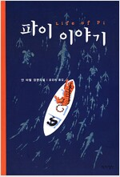

= 파이 이야기(Life of Pi)
얀 마텔, 공경희 옮김 / 작가정신

== 등장 인물

피신 몰리토 파텔(파이)::
주인공

산토시 파텔::
주인공 아버지

프랜시스 아디루바사미(마마지)::
피신에게 수영을 가르친 아버지의 사업 거래인

라비 파텔::
주인공의 형

사티시 쿠마르::
파이가 다닌 중학교의 생물 선생님

마틴 신부::
파이에게 기독교를 전해준 신부

== 기억나는 구절

p.8.::
무슨 일을 하냐고 묻는 사람들에게 "딕터입니다"라고 말하고 싶었으나 참았다. 마법과 기적을 일으키는 사람이 의사니까. 버스가 다음 모퉁이에서 사고가 나면, 승객들의 눈은 의사인 내게 꽃힐테고 난 설명해야 하겠지. 다친 이들의 울음과 신음이 뒤범벅된 와중에서. 닥터는 의사가 아니라 법학박사라는 뜻이었다고. 그러면 사람들은 이번 사고에 대해 정부를 상태로 소송하는 일을 도와달라고 하겠지. 그 지경이 되면 학부 철학과를 졸업했을 뿐이라고 솔직히 고백할 수 밖에. 그러면 사람들은 이런 참사에 어떤 의미가 있느냐고 물어댈 테고, 난 키에르케고르 근처에는 가보비도 않았음을 인정해야 될테고... 난 상처 입은 겸허한 진실을 고수하기로 했다.

p.10::
그때 노신사가 말했다. +
"내 이야기를 들으면, 젋은이는 신을 믿게 될거요" +
나는 흔들던 손을 멈추었다. 의심스러웠다. 여호와의증인인가? +
"이천 년 전 로마 제국의 외진 곳에서 일어난 일인가요?"

p.64::
서커스 조련사에게 가장 순종하는 사자가 자긍이 가장 낮다는 말은 흥미롭다. 말하지면 서열이 가장 낮은 셈이다. 그는 일인자인 조련사와 밀접한 관계를 맺어 많은 것을 얻는다. 억이를 더 먹는 것만이 아니다. 조련사와 가까운 관계면 자존김 강한 다른 동물들로부터 보호를 받게 된다. 대중이 보기에 크기나 사나운 면에 있어서 다른 사자와 다르지 않은 이 유순한 사자가 쇼의 스타가 된다. 반면 조련사는 다루기 힘든 이인자, 삼인자에 핻아하는 사자들을 링 가장자리에 있는 화려한 색깔의 통에 앉게 한다.

다른 서커스 동물들도 마찬가지고, 동물원에서도 비슷한 현상이 일어난다. 사회적으로 열등한 동물이 주인과 사귀기 위해 가장 끈질기게 노력한다. 그들은 주인에게 가장 충직하고 가장 필요한 동반자임을 증명해 보인다. 주인에게 도전하거나 까다롭게 굴지 않겠는다는 것을 보여준다. 이런 현상은 큰고양이, 아메리카들소, 사슴, 야생 양, 원숭이를 비롯한 많은 동물들에게서 관찰된다. 동물업계에는 흔히 알려진 사실이다.

p.70::
토론토에 내가 아는 부인이 있다. 내가 아주 좋아하는 분이다. 그녀는 내 양어머니였다. 내가 '숙모'라고 부르는 것을 그녀도 좋아한다. 그분은 퀘벡 출신이다. 30년간 토론토에서 살았지만, 영어를 들으면 잘 알아듣지 못할떄가 있다. 처음으로 '하레 크리슈나'란 말을 들었을 때도 제대로 알아듣지 못했다. 그 말을 '헤어리스 크리스찬스'라고 들었고, 오랜 세월 그렇게 알고 있었다. 나는 제대로 가르쳐주면서, 사실 그녀가 그리 틀리지 않았다고 말했다. 힌두교도들도 사랑의 용량에 있어서는 대머리 기독교인들과 같다고. 이들람교도들이 모든 사물에서 신을 보는 방식이 수염난 흰두고도와 같고, 기독교도들이 신에게 헌신하는 마음은 모자를 쓴 이슬람교도와 같은 것 아니겠나고.

p.74::
얼마나 대단한 이야기였던지, 우선은 믿을 수 없다는 생각이 들었다. 뭐라고? 인간이 죄를 지었는데 신의 아들이 대가를 치른다고? 아버지가 내게 이렇게 말하는 장면을 상상해봤다. "피신, 오늘 사자가 아메리카낙타의 우리에 들어가서 두 마리를 죽였다. 어제는 또 한놈이 검은 수사슴을 죽였다. 지난주에는 두 놈이 낙타를 먹어버렸다. 그 전주에는 황새와 왜가리가 당했다. 우리 금색 들쥐를 먹어치운놈은 또 누구겠느냐? 더는 참을 수 없는 상황이 되었구나. 조치를 취해야 한다. 나는 사자가 속죄할 길을 너를 사자밥으로 주는 것이라고 결정했다." +
"네, 아버지. 그것이 옳고 합당한 일이겠군요. 저한테 몸을 씻을 시간을 주세요." +
"할렐루아, 내 아들아." +
"할렐루아. 아버지"

p.161::
그때 하이에나가 으르렁거리며 날뛰기 시작했다. 온종일 그 자리에서 꿈쩍 않고 있던 녀석이. 하이에나는 얼룩말의 옆구리에 앞다리를 올리고, 몸을 내밀어 얼룩말의 살을 깨물었다. 그리고는 쭉 잡아 당겼다. 선물 포장이 찢어지듯이 얼룩말의 배에서 가죽이 쭉 벗겨졌다. 소리 없이 살갗이 찢겨나갔다. 곧 피가 강처럼 솟구쳤다. 얼룩말은 짖고, 콧방귀를 뀌고, 깽깽 소리를 내면서 방어하려 했다. 하이에나를 물려고 앞다리를 뻗으며 고개를 젖혔지만 여의치 않았다. 얼룩말이 성한 뒷자리를 흔들자, 전날 밤에 계속 들렸던 뭔가 두드리는 소리의 정체가 밝혀졌다. 발굽으로 배 옆쪽을 내려치는 소리였다. 얼룩말이 자기를 방어하려 하자 하이에나는 마구 으르렁대면서 얼룩말을 물어뜯었다. 얼룩말의 옆구리에 큰 상처가 났다. 뒤에서 공격하는게 만족스럽지 않자, 하이에나는 얼룩말의 엉덩이 위로 올라가싿. 놈은 꼬여 있는 내장과 창자를 당기기 시작했다. 공격에 순서 같은 것은 없었다. 여기를 물어뜯고, 저기를 삼키고, 앞에 놓이 풍족함에 압도당한 듯 했다. 간을 반쯤 먹어치우자, 하이에나는 풍선 간이 생긴 허연 위 주머니를 당기기 시작했다. 하지만 위는 무겁고, 얼룩말이 배를 아래쪽으로 하고 웅크리고 있어서 - 또 피가 흘러 미끄러워서 - 하이에나는 얼룩말의 몸 위에서 미끄러졌다. 녀석은 얼룩말의 배에 머리와 어꺠를 처박고, 앞발의 무릎으로 올라갔다. 몸을 밀어도 계속 미끄러졌다. 마침내 하이에나는 얼룩말의 몸에 몸통을 반쯤 걸치게 되었다. 얼룩말은 안쪽부터 산 채로 먹히기 시작했다.

p.162::
오렌지주스는 이런 행동을 무심히 보지 않았다. 오랑우탄은 일어나더니 벤치 위로 올라섰다. 우스꽝스런 작은 다리와 큰 몸통이, 비뚤어진 바퀴 위에 얹은 냉장고 같았다. 하지만 거대한 팔을 공중에 휘젓는 모습은 당당해 보였다. 팔이 발 아래까지 닿았다 - 한쪽 손을 바다에 담그니, 다른 팔이 구명보트의 맞은 편 가장자리에까지 걸쳐졌다. 오렌지주스는 입술을 별려 어마어마한 송곳니를 드러내더니, 포효하기 시작했다. 깊고, 강하고, 분노에 찬 포료였다. 평소에는 기린처럼 조용한 동물에게는 놀라운 일이었다. 그 소리에 하이에나도 나처럼 깜짝 놀랐다. 녀석은 움찔하며 물러섰다. 하지만 오래가지는 않았다. 오렌지주스를 빤히 쳐다보더니, 목덜미와 어깨의 털이 곧구서고 꼬리가 공중에 바짝 섰다. 녀석은 죽어가는 얼룩말의 몸 위로 다시 올라갔다. 거기서 하이에나는 입으로는 피를 줄줄 흘리면서, 더 높은 소리로 오랑우탄의 비명에 답했다. 두 동물은 입름 벌린 ㅐ 1미터도 안되는 거리에 마주 서 있었다. 기력을 모두 울부짖음에 담은 그들은 안간힘을 쓰느라 몸을 떨었다. 나는 하이에나의 목구멍 깊숙이 들여다볼수 있었다. 잠시 전만 해도 바다의 휘파람과 속삭임을 - 좋은 상황이었다면 마음의 위안이 되는 자연의 멜로디를 - 라르는 태평양의 공기에 돌연 무시무시한 소름이 넘쳐났다. 총과 대포와 수천 개의 폭타이 터지는 듯한 귀를 찢는 소리가 넘쳐나는 총력전이었다. 하이에나의 울부짖음은 높은 음역을, 오랜지주스의 낮은 음역을 채웠다. 그 중간 어딘가에서 무기력한 얼룩말의 울음소리도 들을 수 있었다. 귀가 따가웠다. 다른 소리는, 더이상의 소리는 들을 수가 없었다.

p.173::
그날 마침 내가 생명을 구한 것은, 갈증이 나서 문자 그대로 죽을 지경이었던 때문이라고 믿는다. '갈증'이라는 단어가 머릿속에 떠오르니, 다른 것은 생각도 할 수 없었다. 그 말 자체가 짭짤하기라도 한 것 처럼, 그 생각을 할 수록 결과는 더 나빠졌다. 공기가 부족한 것이 물에 대한 갈증보다 다급하게 느껴진다는 말을 들은 것이 있다. 그러나 몇 분간만 그럴 것이다. 몇 분 후에는 죽을 테고, 질식의 고통을 사라지니까. 반면 갈증은 느릿느릿 일어난다. 보라. 십자가의 예수는 질식해서 죽었지만, 그가 유일하게 불평한 것은 갈증이 아니었던가. 갈증이 인간의 모습으로 온 신까지 불평하게 만들 만큼 힘든 것이라면 보통 인간은 어땠을지 상상해보기를. 나는 미쳐서 펄쩍펄쩍 뛸 것 같았다. 입에서 썩은 맛이 나고 끈적끈적한 것 처럼 고약한 게 있을까. 목구멍 뒤쪽에 달라붙어 있는 참을 수 없는 이 압박감. 이 피가 걸쭉해져서 잘 돌지 않는 느낌. 사실 그런 고통에 비하면 호랑이는 아무것도 아니었다.

p.198::
밤이 찾아들었다. 주위는 칠흙 같은 어둠에 휩싸였다. 떳목의 밧줄이 규칙적으로 당기는 느낌으로만 내가 구명보트와 연결되어 있다는 걸 감지할 수 있었다. 내 바로 밑에 있지만 보이지 않는 바다가 뗏목을 이리저리 밀었다. 물의 손가락이 뗏목 바닥의 벌어진 틈으로 파고들어, 내 엉덩이를 적셨다.

p.220::
슬쩍 내려다보고서도 나는 바다가 '도시'임을 알아차렸다. 내 바로 아래에, 사방에 상상도 못 했던 고속도로, 대로, 좁은 도로, 교차로가 있었다. 해저 통행객이 우글우글했다. 복잡한 바다에는 얼룩 반점이 있는 번들거리는 플랑크톤 수백만개가 점점이 박혀 있었다. 트럭, 버스, 승용차, 자전거, 보행자처럼 정신없이 내달리는 물로기 떼는 경적을 울리고 소리를 질러댔다. 주조색은 초록빛 문이 닿는 곳까지 여러 층을 이루어진 물속에서 물고기 뗴가 속도를 내느라 물을 흔들면, 인광을 내는 초록색 거품으로 이루어진 길들이 순식간에 사라졌다. 한 길이 사라지면 곧 다른 길이 나타났다. 이런 길들이 사방에서 생겼다가 사방에서 자취를 감추었다. 꼭 노출 시간을 길게 해 찍은 사진 같았다. 밤에 도시를 찍은 사진을 보면, 자동차 불빛이 꼬리를 이은 광경이 긴 빨간 줄들로 보이지 않던가. 다만 여기서는 차들이 서로의 머리 위와 몸 아래로 달리고 있었다. 십 층짜리 고가도로 같달까. 또 여기서는 차들이 색깔의 향연을 벌였다. 만새기 떼 - 뗏목 밑에 50마리도 넘는 만새기 떼가 있었을 것이다 - 는 밝은 황금색과 파란색, 초록색을 자랑하며 몰려갔다. 내가 모르는 다른 물고기들은 노란색, 갈색, 은색, 파란색, 빨간색, 분홍색, 초록색, 흰색이었다. 이 모든 색깔이 섞이기도 했고, 단색이거나 줄무늬, 점박이도 있었다. 상어 떼만이 고집스레 우중충한 색깔을 유지했다. 하지만 바다 속 차량이 어떤 크기든, 어떤 색ㅅ아이든 한 가지는 똑같았다. 난폭 운전. 추돌 사고가 많이 일어났고 - 모두 사망 사고일 것이다 - 수많은 차량이 제어력을 잃고 빙빙 돌다가 철책에 부딪쳤다. 수면에는 부산한 움직임이 일어나면서 형광색이 소나기처럼 우르르 떨어졌다. 나는 열기구에서 도시를 내려다보는 사람처럼 도심의 혼잡을 물끄러니 내려다봤다. 놀람고 경외심을 일으키는 광경이었다. 도쿄의 러시아워가 꼭 이런 광경이겠지.