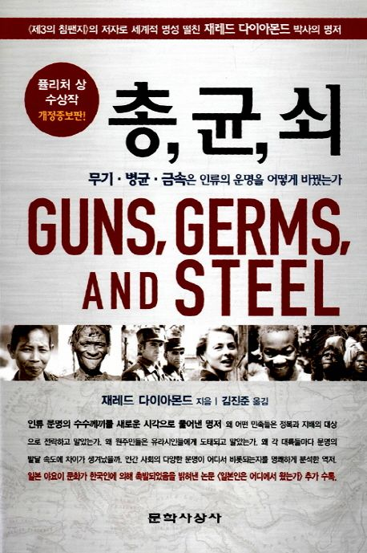

= 총,균,쇠(Guns,Germs and Steel)
제레드 다이아몬드, 김민준 옮김 / 문학사상사

p.18::
"당신네 백인들은 그렇게 많은 화물들을 발전시켜 뉴기지까지 가져왔는데 어째서 우리 흑인들은 그런 화물을 만들지 못한 겁니까?" +
간단한 질문이지만 그것은 얄리가 경험한 삶의 핵심을 꿰뚫고 있었다. 그렇다. 평균적인 뉴기니인들의 생활 양식과 평균적인 유럽인이나 미국인의 생활 양식 사이에는 아직도 엄청난 차이가 있다. 그와 같은 생활 양식의 격차는 세계의 다른 여러 민족들 사이에도 존재한다. 그렇게 커다란 불균형이 생긴 데에는 틀림없이 얼핏 생각하면 자명해 보일는지도 모르는 몇 가지 설득력 있는 원인들이 있을 것이다. +
그러나 겉으로는 간단해 보여도 얄리의 질문에 대답하기란 결코 쉬운일이 아니다. 역사학자들도 그 문제의 해답에 대해서는 여전히 의견의 일치를 보지 못하고 있으며 이제는 아예 그런 질문을 던지지도 않는 경우가 대부분이다. 얄리와 가른 대화를 나눈 이후로 나는 인류의 진화, 역사, 언어 등 다른 여러 측면들에 대해 연구하고 집필해 왔다. 그리고 25년이 지난 지금이 책을 통해 비로소 얄리의 질문에 대답해 보려고 한다.

p.48::
인류와 가장 가까운 살아있는 친척이라고 할 수 있는 동물들은 아직 멸종되지 않은 세 종의 대형 유인원 - 고릴라, 침팬지, 피그미 침팬지 - 이다. 이 유인원의 분포가 모두 아프리카에 국한되어 있다는 사실은 풍부한 화석 증거와 더불어 인류 진화의 초기 단계가 바로 아프리카에서 진행되었음을 보여준다. 동물의 역사와 구별되는 인류의 역사는 바로 그곳에서 약 700만 년 전(의견이 분분하지만 대략 500만년 ~ 900만년)에 시작되었다. 그 시기에 아프리카 유인원의 한 부류가 몇 갈래로 나누어졌다. 그 중의 첫 번째는 현대의 고릴라로 진화했고, 두 번쨰는 현대의 침팬지, 그리고 세 번째가 인간이 되었다. 고릴라의 계통은 침팬지와 인간의 계통이 분기된 시기보다 조금 먼저 분기되었다.

p.74::
모리오리족의 비극은 현대 세계와 고대 새계를 맞론하고 벌어졌던 수많은 비극과 마찬가지로 좋은 장비를 갖춘 다수와 나쁜 장비를 갖춘 소수가 부딪친 사건이었다. 마오리족과 모리오리족의 충돌을 더욱 소름끼치게 만드는 것은 두 집단이 모두 1000년경에 뉴질랜드로 이주했던 폴리네시아 농경민의 후손이라는 점이다. 그로부터 머지않아 마오리족의 한 무리가 다시 채텀 제도로 이주하여 모리오리족이 되었던 것이다. 두 집단은 헤어진 후 몇 세기에 걸쳐 서로 반대 방향으로 발전했다. 북섬의 마오리족은 점점 복잡한 기술과 정치적 조직을 발달시켰고 모리오리족은 오히려 더 단순한 기술과 정치적 조직으로 후퇴했다. 모리오리족이 수렵 채집민으로 되돌아가는 동안 북섬의 마오리족은 더욱 집약적인 농업에 매달렸다.

p.124::
그리고 저장된 식량이 있으면 정복 전쟁에 종교적 정당성을 부여하는 사제들, 칼이나 총기를 비롯하여 각종 기술을 발전시키는 금속 기술자등의 숙련공, 그리고 기억력에 의존하는 것 보다 훨씬 더 많은 정보를 정확하게 보존시켜주는 필경사 등도 먹여살릴 수 있다.