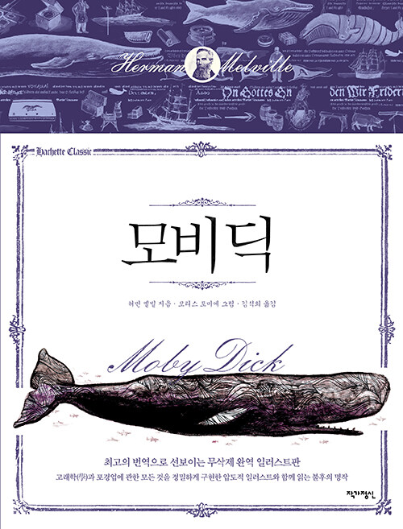

= 모비 딕(Moby Dick)
허먼 멜빌, 김석희 옮김, 작가 정신(아세트 클래식 4)

== 등장 인물

이슈메일::
작중 화자

퀴퀘그::
이슈메일이 뉴베드퍼드에서 `묵은 물보라 여인숙 - 피터 코핀` 여관에서 같은 방을 사용하게된 작살잡이

메플 목사::
젊었을 때 선원이요 작살잡이 였던 목사

== 기억나는 구절

p.31::
내 이름을 이슈메일이라고 해 두자. 몇 년 전 - 정확히 언제인지는 아무래도 좋다 - 지갑은 거의 바닥이 났고 또 뭍에는 딱히 흥미를 끄는 것이 없었으므로, 당분간 배를 타고 나가서 세계의 바다를 두루 돌아보면 좋겠다는 생각을 했다. 그것은 내가 우울한 기분을 떨쳐버리고 혈액순환을 조절하기 위해 늘 쓰는 방법이다. 입 언저리가 일그러질 때, 이슬비 내리는 11월처럼 내 영혼이 을씨년스러워질 때, 관을 파는 가게 앞에서 나도 모르게 걸음이 멈추거나 장례 행렬을 만나 그 행렬 끝에 붙어서 따라갈 때, 특히 심기증에 짓눌린 나머지 거리로 뛰쳐나가 사람들의 모자를 족족 후려쳐 날려 보내지 않으려면 대단한 도덕심이 필요할 때, 그럴 때면 나는 되도록 빨리 바다로 나가야 할 때가 되었구나 하고 생각한다. 이것이 나에게는 권총과 총알 대신이다. 카도는 철학적 미사여구를 뇌까리면서 칼 위에 몸을 던졌지만, 나는 조용히 배를 타러간다. 이것은 전혀 놀라운 일이 아니다. 바다를 알기만 하면 누구나, 정도의 차이는 있겠지만, 언젠가는 바다에 대해 나와 비슷한 감정을 품게 될 것이다.

p.76::
낸터컷으로 떠나기 전날 밤 내가 어떤 기분으로 그 대리석 명판들을 바라 보았는지, 그 어둡고 우울한 날 희미한 빛 속에서 나보다 먼저 간 고래잡이들의 운명을 읽으면서 어떤 기분을 느꼈는지는 굳이 말할 필요가 없을 것이다. 그래, 이슈메일. 너도 저런 운명을 당할 수 있어. 하지만 어떻게든 나는 다시 쾌활해졌다. 이건 어서 배를 타라는 유쾌한 권유. 출세할 수 있는 좋은 기회일 것이다. 그래, 내가 탄 보트에 구멍이 뚫리면 나는 불멸의 존재로 출세하는 셈이지. 그래, 고래잡이는 목숨을 걸어야 하는 일이야. 아차! 하는 순간에 인간을 영원의 세계로 처넣고 마니까. 하지만 그래서 어쨌다는 거지? 우리는 이 삶과 죽음이라는 문제를 매우 잘못 생각해온 것 같아. 여기 지구상에서 소위 그림자라고 불리는 거싱 사실은 우리의 진정한 실체인지도 몰라. 우리가 영적인 것을 바라봄에 있어서 그것음 마치 굴조개가 바다 밑에서 태양을 바라보며 흐린 물을 가장 맑은 공기라고 생각하는 것과 같을지도 몰라. 내 몸뚱이는 더 나은 내 준재의 찌꺼기일 뿐인지도 몰라. 원하는 사람은 내 몸뚱이를 가져가도 좋다. 맘대로 가져가. 이건 내가 아니니까. 그러니, 낸터컷을 위해 만세 삼창! 구멍 뚫린 보트, 구멍 뚫린 몸뚱이는 언제든지 올테면 와라. 하지만 주피터라 할지라도 내 영혼에 구멍을 뚫을 수는 없으리라.

p.82::
고래의 갈빗대와 공포는 +
내 위에 음울한 어둠을 아치 모양으로 덮어씌우네. +
햇빛을 받은 신의 파도는 모두 굽이치며 지나가 버리고, +
뒤에 남겨진 나는 어둠속으로 점점 더 깊이 빠져드네. +
+
나는 보았네, 지옥이 아가리를 벌리고 있는 것을. +
그곳에는 끝없는 고통과 슬픔이 있었지. +
느끼는 사람만이 알 수 있는 고통과 슬픔 - +
오, 나는 절망에 빠져들고 있었네. +
+
캄캄한 절망속에서 주님을 불렀네. +
나는 그가 주님이라는 것을 믿을 수 없었지만, +
주님은 내 기도에 귀를 기울여주셨네 - +
고래는 더 이상 두려움이 아니네. +
+
주님은 나를 구하러 날아오셨네. +
빛나는 돌고래를 타고 오신 듯. +
나를 구해준 주님의 얼굴은 +
번개처럼 무섭고도 찬란하게 빛나네. +
+
나는 영원히 노래부르리. +
그 공포의 순간과 환희의 순간을. +
모든 영광을 주님에게 바치리. +
자비도 권능도 모두 주님의 것.

p.83::
"친애하는 선원 동료 여러분. 요나서 1장 마지막 절을 펴세요. '주께서 이미 큰 물고기를 예비하사 요나를 삼키게 하셨느니라'"

p.90::
그리하여 요나는 닻처럼 끌어 올려졌다가 바다에 던져집니다. 그러자 당장 기름을 바른 듯한 평온이 동쪽에서 떠오리고, 바다는 잔잔해집니다. 요나가 바닷속으로 강풍을 가져가자 잔잔한 수면만 뒤에 남습니다. 오나는 소융돌이 치는 혼란의 중심으로 내려갑니다. 혼란이 너무 심해서, 요나는 그를 가디라고 있는 별린 입 속으로 떨어지는 순간을 거의 알아차리지 못합니다. 고래는 하얀 이빨을 수많은 빗장처럼 단단히 걸어서 요나를 감옥에 가둡니다. 그러자 요나는 물고기의 배 속에서 꺼내달라고 주님에게 기도를 드립니다. 하지만 그의 기돌르 듣고 중요한 교훈을 얻으세요. 요나는 너무 죄가 커서, 눈물을 흘리며 주님이 곧바로 구원해주기를 기자리지 않습니다. 그는 자기가 무서운 벌을 받는 것이 마땅하다고 느낍니다. 그는 모든 구원을 하느님에게 맡기고 여기에 만족합니다. 아무리 괴롭고 고통스러워도 그는 여전히 하느님의 성전을 바라볼 것입니다. 여러분, 바로 여기에 진실하고 성실한 회개가 있습니다. 용서해달라고 시끄럽게 울부짖지 말고, 벌 받는 것을 고맙게 여기는 것입니다. 요나의 이런 태도가 하느님게에 얼마나 만족스러웠는지는 결국 요나가 바다와 고래로부터 구출되는 것에 드러나 있습니다. 여러분, 나는 요나의 죄를 본받으라고 요나를 여러분 아에 내놓는 것이 아니라, 회개의 본보기로서 내놓는 것입니다. 죄를 짓지 마세요. 하지만 만약 죄를 지었자면 요나처럼 그 죄를 회개하세요.

p.103::
그보다는 지금보다 훨씬 선량하게 만드는 방법을 기독교도한테 배우고 싶은 열망이었다고 한다. 하지만 안타깝게도 고래잡이로 일하는 동안 그난 곧 기독교도들도 비참하고 사악할 수 있다는 것, 아버지의 신하인 이교도들보다도 훨씬 더 그럴 수 있다는 것을 깨닿게 되었다. 마침내 새그 항에 도착한 그는 그곳에서 선원들이 급료를 어떻게 쓰는지 보았을 때, 퀴퀘그는 가엸게도 절망에 빠지고 말았다. 세계는 자오선과 관계없이 아디나 사악하다. 그렇다면 나는 차라리 이교도로 살다 죽겠다고 맹세했다.

p.108::
하지만 마침 그때, 선장 자신이 조심해야 할 일이 일어났다. 큰 돛에 너무 큰 압력이 가해져서 아딧줄이 끊어지는 바람에 거대한 활대가 뒷갑판 전체를 휩쓸면서 이쪽에서 저쪽으로 날아다니고 있었다. 퀴케그에게 혼이 난 그 가엾은 녀석도 활대웨 흡쓸려 뱃전 너머로 떨어지고 있었다. 사람들은 모두 공포에 사로잡혔지만, 활대를 붙잡아 멈추게 한다는 것은 미친 짓에 지나지 않았다. 활대는 시계가 한 번 째깍하는 사이에 오른쪽에서 왼쪽으로 날아갔다가 되돌아왔고, 당장이라도 산산조각으로 쪼개질 것 같았다. 모두 속수무책이었고, 어떻게 해볼 도리도 없는 것 같았다. 갑판에 있는 사람들은 뱃머리 쪽으로 달아나서, 활대가 성난 고래의 아래턱이라도 되는 것처럼 지켜보며 서 있었다. 모두 놀라서 어쩔 줄 모르고 있을 때 퀴케그가 무릎을 끓고 활대 아래를 능숙하게 기어가더니 밧줄 하나를 낚아챘다. 그러고는 밧줄의 한쪽 끝을 뱃전에 붙들어 맨 다음, 활대가 그의 머리 위를 홱 지나갈때 밧줄의 반대쪽 끝을 올가미처럼 던져서 활대를 감았다. 이어서 밧줄을 힘껏 잡아당기자 활대는 올가미에 걸려들었고 사태는 무사히 수습되었다. 배는 바람이 불어오는 쪽으로 방향을 바꾸었다. 선원들이 고물 쪽 보트를 내리고 있을 때, 퀴케그가 웃통을 벗어부치고는 뱃전에서 길다란 포뮬선을 그리며 바다로 뛰어들었다. 그는 긴 팔을 앞으로 죽죽 내뻗으며, 얼어붙을 듯이 차가운 물거품 속에서 건장한 어깨를 번갈아 드러내며 3분이 넘도록 헤엄을 치고 있었다. 그 당당하고 훌륭한 사내를 바라보는 내 눈에 정작 구조되어야 할 사내는 보이지 않았다. 그 풋내기는 벌써 물속에 가라앉은 듯 했다. 이제 퀴케그는 물에서 수직으로 솟구쳐 올라 잠시 주위를 둘러보며 상황을 파악하는가 싶더니, 다시 물속으로 잠수하여 사라졌다. 몇 분 뒤에 그는 다시 물 위로 올라왔다. 한 팔은 여전히 힘차게 물을 젓고 있었지만, 다른 팔로는 축 늘어진 사내를 안고 있었다. 보트가 곧 그들을 끌어올렸다. 가엾은 시골뜨기는 의식을 되찾았다. 모든 사람이 퀴케그를 대단한 사람이라고 칭찬했다. 선장도 미안하다고 사과했다. 그때부터 나는 따깨비처럼 퀴케그한테 찰싹 달라붙었다. 가엷은 퀴케그가 마지막으로 영원히 물속에 뛰어들 때까지.

p.138::
우리 선량한 장로파 기독교도들은 이런 일에 너그러워야 하고, 이교도든 아니든 다른 사람들이 이 문제에 대해 반미치광이 같은 생각을 갖고 있다고 해서 우리가 그들보다 훨씬 우월하다고 생각해서는 안 된다. 퀴퀘그는 요조와 라마단에 대해 터무니없는 생각을 품고 있는 것이 분명하지만, 그래서 그게 어쨌단 말인가? 퀴퀘그는 자기가 하고 있는 일을 잘 안다고 생각했을 것이다.그는 만족스러워 보였다. 그렇다면 다음대로 하게 내버려두자. 우리가 아무리 그와 논쟁을 벌여도 소용없을 것이다. 그를 그냥 내버려두자. 하늘이여, 장로파건 이교도건, 우리 모두에게 자비를 베푸소서. 왜냐하면 우리는 모두 머리가 끔찍하게 손상되어 있어서 수리할 필요가 있기 때문입니다.

p.143::
앞에서도 말했듯이, 나는 누가 어떤 종교를 믿든, 그 사람이 자기와 다른 종교를 믿는다는 이유로 남을 죽이거나 모욕하지 않는 한, 그 사람의 종교에 대해 어떤 이의도 제기하지 않는다. 하지만 어떤 사람의 종교가 정말로 광신적이 되어 그 사람에게 명백한 고통이 되면,  그리하여 결국 우리의 이 지구를 살기 힘든 곳으로 만들어버리면, 그 개인을 구석으로 데려가서 문제점을 따질 때가 되었다고 생각한다.

p.147::
저는 선장님과 저 그리고 저기 계시는 펠레그 선장님과 여기 있는 쿼퀘그, 우리 모두, 모든 어머니의 아들과 우리의 영혼이 속해 있는 유서깊은 카톨릭 교회를 말씀드라는 겁니다. 신을 경배하는 이 세계의 위대하고 영원한 제1조합교회 말입니다. 우리는 모두 거기에 속해 있습니다. 다만 우리들 가운데 일부는 좀 별난 생각을 품고 있지만, 그리도 그 숭고한 믿음은 전혀 영향을 받지 않습니다. 그 점에서 우리는 모두 손을 맞잡고 있습니다.

p.149::
경건한 작살잡이는 절대로 훌륭한 항해자가 될 수 없어. 독실한 신앙은 작살잡이한테서 상어 같은 흉포성을 없애버리지. 흉포하지 않은 작살잡이는 한 푼의 가치도 없어. 냇 스웨인이라는 젊은이는 한때 낸터컷과 비니어드 전체에서 가장 용감한 작살잡이였는데, 예배에 참석한 뒤로부터는 한 번도 좋은 결과를 얻지 못했어. 스웨인은 그 빌어먹을 영혼을 너무 걱정했기 때문에, 보트에 구멍이 뚫려 물고기 밥이 되었을 경우 뒤탈이 무서워서 고래를 보면 겁에 질려서 피하게 된거야!

p.168::
펠레그와 빌대드, 특히 빌대드 선장이 이 돛단배의 접근에 열마나 영향을 받았는지는 흥미롭고 유쾌한 일이었다. 거센 푹풍우가 몰아치는 혼 곶과 희망봉을 돌고 도는 험한 항해를 떠나는 배, 힘들게 번 수천 달러를 투자한 배, 옛 동료가 선장으로서 지휘하고 있는 배를 떠나는 게 싫고, 무지비한 고래 턱의 공포와 맞서기 위해 다시 한 번 떠나는 나이도 비슷한 사내와 헤어지는 게 싫고, 모든 면에서 흥미진진한 일에 작별을 고하는 게 싫어서, 가엾은 발대드 영감은 오래도록 꾸물거리며 불안한 걸음으로 갑판을 걸어 다니고, 선실로 뛰어 내려가 또 다시 작별 인사를 하고, 다시 갑판으로 올라와서 바람이 불어오는 쪽을 바라보았다. 그리고 너무 멀리 떨어져있어서 보이지 않는 동쪽 대륙에 이를 때 까지 거칠 것 없이 펼쳐져 있는 드넓고 끝없는 바다를 바라보고, 육지를 바라보고, 하늘을 쳐다보고, 오른쪽과 왼쪽을 바라보고, 모든 곳을 보면서도 아무 데도 보고 있지 않았다. 그러다가 마침내 밧줄을 말뚝에 기계적으로 감으면서 건장한 펠레그의 손을 발작적으로 움켜잡더니, 등불을 들어올려 펠레그의 얼굴을 과장되게 들여다보며 잠시 서 있었다. "그래, 펠레그. 나는 참을 수 있어. 아무렴, 참을 수 있고 말고"하고 말하는 듯했다.

p.186::
스터브가 그렇게 특이한 기질을 갖게된 원인은 여러 가지가 있겠지만, 이 줄담배도 하나의 원인이었을 게 분명하다. 누구나 알고 있듯이, 이 지상의 공기는 육지든 바다든 간에 공기를 내쉬면서 죽은 수 많은 사람들의 형언할 수 없는 비참함으로 심하게 오염되어 있기 때문이다. 콜레라가 유행할 때 처럼 밖에 나갈 때는 장뇌로 처리한 손수건을 입에 대고 다니는 사람들도 있다. 그와 마찬가지로 스티브의 줄담배는 모든 정신적 시련을 없애주는 일종의 소독약으로 작용했을지도 모른다.

p.243::
"지금까지 좇대 꼭대기에 올라간 녀석들은 모두 내가 흰 고래에 대해 명령한 것을 들어서 알고 있다. 보라! 여기 스페인 금화가 있다!" 에이헤브는 반짝반짝 빛나는 커다란 금화 한 닢을 태양 쪽으로 들어 올렸다. "이건 16달러 짜리 금화다. 스타벅, 거기 있는 망치를 이리 가져오게." +
항해사가 망치를 가져오는 동안, 애이해브는 아무 말도 하지 않고 금화에 더욱 광택을 내려는 것 처럼 금화를 재킷 자락에 천천히 문지르고 있었다. 그러면서 낮은 소리로 혼자 콧노래를 불렀다. 그가 내는 소리는 무언가에 틀어 박힌 것 처럼 불분명해서, 그의 몸속에 있는 생명의 바퀴가 기계적으로 윙윙거리는 소리처럼 들렸다. +
스타벅에게 망치를 건네받자, 그는 한 손으로 망치를 높이 들어 올리고 다른 손에 쥔 금화를 모두 볼 수 있도록 내보이며 주돛대 쪽으로 걸어갔다. 그리고 목청 높이 외쳤다. +
"이마에 주름이 잡혀 있고 턱이 우그러진 고래를 발견하는 자, 대가리나 희고 오른쪽 꼬리에 구멍이 세 개 뚫린 고래를 발견하는 자, 그 흰 고래를 발견하는 자에게 이 금화를 주겠다!" +
"야호! 야호!" 선원들은 돛대에 금화를 못 박는 선장에거 방수모를 휘둘러 갈채를 보내면서 외쳤다.

p.245::
"누가 그따위 얘기를 하던가?" 에이해브는 목소리를 높여 말하고 나서, 한숨을 내쉬고는 말을 이었다. "그래, 스타벅. 그리고 모두 잘 들어주기 바란다. 내 돛대를 앗아간 녀석은 바로 모비 딕이었다. 그리고 내가 지금 의지하고 서 있는 이 죽은 다리를 가져다 준 놈도 모비 딕이었어. 그래, 그래." 그는 비탄에 빠진 사슴처럼 동물적인 소리로 울부짖었다. "그래, 그래. 나를 파괴하여 영원히 의족에 의지하는 가엾은 신세로 마든 건 바로 가증스러운 흰 고래였다!" 그러고는 두 팔을 번쩍 들어 올려 헤아릴 수 없는 저주가 담긴 목소리로 외쳤다. "그래, 그래! 나는 희망봉을 돌고 지옥의 불길을 돌아서라도 놈을 추적하겠다. 그놈을 잡기 전에는 절대로 포기하지 않는다. 대륙의 양쪽에서, 지구 곳곳에서 그놈의 흰고래를 추적하는 것, 그놈이 검은 피를 내뿜고 지느러미를 맥없이 늘어뜨릴 떄까지 추적하는 것, 그것이 우리가 항해하는 목적이다. 어떠냐? 나를 도와주겠는가? 다들 용감해 보이는데."

p.267::
나 이슈메일도 이 배에 타고 있는 선원들 중의 하나였다. 나의 외침도 그들의 외침과 함께 솟아올랐고, 나의 맹세도 그들의 맹세와 함꼐 뒤섞였다. 나는 내 영혼 속의 두려움 때문에 더 큰 소리로 외치고, 내 맹세를 더 힘껏 망치로 못질하여 단단히 고정시켰다. 나에게는 격력하고 불가사의한 공감이 있었다. 에이헤브의 억누를 수 없는 원한이 내 것 처럼 느껴졌다. 나는 선원들과 더불어 저 흉악한 괴물을 죽여서 원수를 갚겠다고 맹세하면서, 그 괴물의 내력을 알고 싶어 열심히 귀흘 기울였다.

p.273::
어떤 선장의 경우는 보트 세 척이 주위에 박살이 났고, 노와 부하들은 소용돌이에 휘발려 빙빙 돌고 있었다. 선장은 단검을 뺴들고 부서진 뱃머리에서 아칸소의 결투자가 상대에게 덤벼들듯 고래에게 덤벼들어, 한 뼘 길이의 칼날로 한 길 깊에 있는 고래의 생명에 닿으려고 애썼다. 그 선장이 바로 애이해브다. 낫처럼 생긴 고래의 아랫턱이 갑자기 바로 빝을 휙 스키고 지나가는가 싶더니, 풀을 베는 기계가 들에서 풀을 베듯 에이해브의 다리를 싹둑 잘라버리고 말았다. 터번을 두른 터키인도, 베네치아나 말레이의 용병도 그보다 더 잔인하게 그를 공격할 수는 없었을 것이다. 그렇다면 거의 죽을 뻔했던 그 결쿠 이후 에이해브가 그 고래에 대해 격렬한 복수심을 품고 있었다는 것은 의심할 여지가 없다. 하지만 복수심보다 더 무서운 것은, 에이해브가 광적일 정도로 과민해져서 결국에는 자신의 육체적 고통만이 아니라 지적·정신적 분노까지도 모두 흰 고래와 결부시켰다는 점이다. 흰 고래는 모든 사악한 존재의 편집광적 화신으로서 에이해브의 눈앞을 끊림없이 헤엄치게 되었다. 깊은 통찰력과 감수성을 가진 사람들은 그 사악한 존재에게 자기 내부를 갉아 먹혀 급기야는 절반밖에 남지 않은 심장과 허파로 살아갈 수밖에 없다고 느낀다. 이 어떻게 할 수 없는 악이야말로 태초부터 존재해왔고, 근대에 들어와서는 기독교도들조차 세상의 절반을 지배하는 존재로 인정했으며, 고대 동방의 배사로 신자들은 악마상을 만들어 숭배했다. 하지만 애이해브는 그들처럼 무릎을 꿇고 드것을 숭배하지는 않았다. 오히려 밉살스러운 흰 고래에게 모든 악의 근원을 돌려, 미친 듯이 날쮜며 불구의 몸도 아랑곳하지 않고 그것에 덤벼들었다. 사람을 가장 미치게 하고 괴롭히는 모든 것, 가라앉은 앙금을 휘젓는 모든 것, 악의를 내포하고 있는 모든 진실, 체력을 떨어뜨리고 뇌를 굳게하는 모든 것, 생명과 사상에 작용하는 모든 악마성 - 이 모든 악이 미쳐버린 애이해브에게는 모비딕이라는 형태로 가시화되었고, 그리하여 실제로 공격할 수 있는 상대가 되었다. 에이해브는 아담 이후 지금까지 모든 인류가 느낀 분노와 증오의 총량을 그 고래의 하얀 혹 위에 쌓아 올려, 마치 자기의 가슴이 대포라도 되는 것 처럼 마음 속에서 뜨거워진 포탄을 그곳에다 겨누고 폭발시켰던 것이다.

p.279::
여기, 신조차 두려워하지 않는 백발노인, 증오심에 가득 차서 욥의 고래를 찾아 세상을 돌아다니는 노인이 있었고, 그의 부하 선원들은 주로 더러운 배반자와 세상에서 버림받은 자, 그리고 식인종으로 이루어져 있었다. 게다가 스타벅은 미덕과 상식을 가졌으나 동조자가 없어서 별 영향력이 없었고, 스터브는 태평한 성품이어서 매사에 무관심했으며, 플래스크는 모든 면에서 평범한 위인이어서, 정신적인 지주가 될 만한 인물이 없었다. 그런 항해사들의 지휘를 받는 선원들은 처음부터 에이해브의 편집광적 복수를 둡게 하려는 목적에서 어떤 악마적 운명에 의해 특별히 차출된 일당인 것 같았다. 그들은 도대체 왜 노인의 분노에 그토록 열광적으로 응했던 것일까. 그들의 영혼은 도대체 어떤 사악한 마력에 잡혀 있었기에 때로는 노인의 증오를 자신의 증오로 여기게 되었을까. 흰 고래는 도대체 그들에게 어떤 존재였는가. 그들의 무의식적인 인식 속에서 흰 고래는 인생의 바다를 헤엄치는 거대한 악마처럼 보였을지도 모른다. 그들은 흰 고래를 막연히 그렇게 생각하고 거기에 대해 전혀 의문을 품지 않았을 것이다. 이 모든 것을 설명하려면 이슈메일이 내려갈 수 있는 깊이보다 훨씬 깊은 곳까지 잠수해야 할 것이다. 우리들 모두의 마음속에서 광부가 일하고 있다면, 쉴 새 없이 달라지는 광부의 희미한 곡괭이 소리를 듣고는 그가 어느 쪽으로 무엇을 향해 달려가고 있는지 알 수 없다. 누구는 거역할 수 없는 힘이 이끌려 가고 있다는 것을 느끼지 않는 사람이 있을까? 74문의 대포를 장착한 군함이 끌어당기는데 가만히 서 있을 수 있는 작은 배가 있을까? 나는 그 시간과 장소를 탐닉하는 데 전념했지만, 그 고래를 만나려고 돌진하는 동안은 그 짐승에게서 지둑한 악밖에는 볼 수 없었다.

p.281::
모비 딕에게는 이따금 모든 사람의 영혼 속에 공포를 불러일으키는 두드러진 특징이 몇 가지 있지만, 그것과는 별도로 뭐라고 형언할 수 없는 막연한 공포가 존재했는데, 이 공포는 이따금 그 강렬함으로도 나머지 특징을 완전히 압도해버리곤 했다. 하지만 너무 신비롭고 거의 말로 표현할 수 없기 때문에, 그것을 남들이 이해할 수 있게 리록하는 것은 포기해야 할 것이다. 무엇보다도 나를 몸서리치게 한 것은 고래의 색깔이 희다는 사실이다. 그런데 여기서 내 말뜻을 정확히 설명하려면 어떻게 해야 좋을지 모르겠다. 하지만 그에 대한 설명이 없다면 이 책 전체가 아무 의미도 없어질테니, 막연하게 나마 닥치는 대로 설명하지 않으면 안 될 것 같다.

p.291::
하얀 은하수의 심연을 쳐다보고 있을 때, 우주의 무정한 공허함과 광막함을 넌지시 보여주어 무서운 절멸감으로 우리의 등을 찌르는 것은 그 색깔의 막연한 불확정성이 아닐까? 흰색은 본질적으로 색깔이라기 보다 눈에 보이는 색깔이 없는 상태인 동시에 모든 색깔이 응집된 상태가 아닐까? 넓은 설경이 그렇게 아무것도 없는 공백이지만 그렇게 의미로 가득차 있는 것은 이런 이유 때문일까? 무색이면서도 모든 색깔이 함축된 무신론 같아서 우리를 움추러들게 하는 것일까? 자연철학자, 즉 물리학자들의 이론에 따르면, 이 지상의 모든 색채, 감미롭고 장엄한 모든 광채, 이를테면 해 질 녁의 하늘과 숲의 감미로운 색깔이나 금박 올린 벨벳 같은 나비의 날개, 소녀들의 나비 같은 뺨, 이 모든 것은 교묘한 속임수일 뿐이어서 그 물질에 실제로 내제해 있는 것이 아니라 외부에서 주어지는 것에 불과하다고 한다. 그래서 신격화된 '자연'은 매춘부처럼 진한 화장으로 우리를 유혹하지만, 그 매력은 속에 있는 납골당을 가리고 있을 뿐이다. 한 걸음 더 나아가서 생각해보자. 자연물의 온갖 색채를 만들어내는 그 신비로운 화장품, 즉 빛의 원리도 본질적으로는 영원히 흰색이나 무색이어서, 매개불 없이 짃접 물질에 작용하면 튤립이나 장비도 그 자체의 공허한 색조로 물들게 할 뿐이다. 이런 것들을 생각하면, 우주는 수족이 마비된 나병환자처럼 무력하게 우리 앞에 누워 있다. 눈과 얼음에 덮힌 다플란드를 여행하면서 색안경을 쓰기를 거부하는 고집쟁이 여행자처럼, 저주받은 이단자는 주위의 모든 경치를 뒤덮고 있는 그 엄첟나게 큰 하연 수의 앞에서 장님처럼 멍해질 뿐이다. 그리고 이 모든 것의 상징이 바로 흰 고래인 것이다. 그래도 여러분은 이 광적인 추적을 의아하게 생각하겠는가.

p.298::
이따금 에이해브는 밤중에 견딜 수 없이 생생하여 심신을 지체게 하는 꿈을 꾸고 그물침대에서 뛰쳐나오곤 했다. 그 꿈은 온종일 그를 짓놀럿던 격렬한 생각의 반복이었고, 온갖 상념이 불꽃을 튀기며 거로 충돌하는 망념속을 뛰어다니고 불타는 두뇌 속에서 소용돌이 치며 회전하고 결국에는 고동치는 생명의 맥박 자체가 견디기 어려운 고뇌의 근원이 되었다. 때로는 이 정신적인 고뇌가 에이해브의 존재 자체를 그 근처에서 떠오르게 하고, 그 밑에 있는 심연을 노출시켜 거기에서 화염과 번갯불이 솟아오르고 저주받은 악귀들이 그 심연으로 뛰어내리라고 그에게 손짓할 때도 있었다. 이처럼 내면의 지옥이 발치에서 입을 벌리면, 고독한 야수의 무시무시한 울부짖음이 배 전체에 울려퍼지고, 에이해브는 마치 불붙은 침대에서 뛰쳐나오듯 두 눈을 번득이며 선실에서 뛰쳐나온다. 그러나 이런 일들은 에이해브가 지닌 잠재작 약점의 징후도 아니고 자신의 결심에 대한 두려움을 저도 모르는 사이에 드러내는 것도 아니다. 오히려 그 결의의 치열함을 분명히 보여주는 표시일 것이다. 무언가에 집중하는 애이해브, 흰 고래를 절처하고 집요하게 추적하는 사냥꾼으로 계획적이로 냉정하기 이를데 없는 에이해브, 해도를 검토한 뒤 침대에 들어가는 에이해브는 공포에 질려 침대에서 도망쳐 나오는 애이해브와는 전혀 다른 사람이었기 때문이다. 에이해브를 침대에서 도망치게 한 것은 그에게 내재하는 영원한 생명 원칙, 즉 영혼이었다. 그것은 보통 때에는 그의 인경을 형성하는 정신에 실려다이면서 그 도구나 매게체로 이용되지만, 잠자고 있을 때에는 그 정신에서 잠시 떨어져 나온다. 에이해브가 밤중에 침대에서 도망쳐 나온 것은 이성이 이제 더 이상 합일체가 아닌 광적인 것과의 접촉을 자발적으로 회피한 결과다. 그러나 정신이라는 것은 영혼과 결부되지 않으면 존재할 수 없다. 따라서 에이해브의 경우에는 자신의 온갖 상념과 상상을 오직 한 가지의 숭고한 목적에 바쳤고, 그 목적은 자신의 완고한 의지로 신과 악마에게 거역함으로써 일종의 독불장군처럼 독립적인 존재물이 되었다. 아니, 그 목적은 그것이 원래 결부되어 있는 평범한 생명력이 초대박지 않은 사생아의 탄생에 놀라서 도망친 뒤에도 계속 살아서 불탈수 있었다. 그렇기 때문에 에이해브처럼 보이는 어떤 존재가 선장실에서 뛰쳐 나왔을 때, 그 육체의 눈에서 번득이는 고통의 정신은 그때 이미 알맹이 없는 껍데기, 형체 없는 몽유병적 존재였다. 물론 한 줄기 생명의 빛이기는 했지만, 그 본래의 색을 발생시킬 대상이 없었기 때문에 그야말로 허무 그 자체였다. 늙은이여, 하느님이 당신을 도와주실거요. 당신의 생각이 당신 안에 또 하나의 생명체를 창조했소. 자신의 치열한 생각 때문에 스스로 프로메테우스가 된 인간. 당신의 심장을 영원히 쪼아먹는 독수리. 그 독수리야 말로 당신이 창조한 생명체인 것이오.

p.306::
첫 번째 사례. 1820년에 폴러드 선장이 지휘하는 낸터컷의 '에식스'호가 태평양을 순항하고 있었다. 어느날 고래가 내뿜는 물줄기를 보고 보트를 내려 향유고래 떼를 추격했다. 오래지 않아 고래 몇 마리가 상처를 입었다. 그때 보트를 피해 달아나고 있던 고래 한 마리가 갑자기 무리에서 뛰쳐나오더니 곧장 본선을 향해 돌진했다. 이마로 선체를 들이받아서 구멍을 뚫어놓자, 십 분도 지나기 전에 배는 옆으로 쓰러져 가라않고 말았다. 그 후 널빤지 하나 발견되지 않았다. 호된 시련을 겪은 끝에 일부 선원은 보트를 타고 육지에 이르렀다. 마침내 구사일생으로 고향에 돌아온 폴러드 선장은 다른 배를 지휘하여 다시 태평양으로 향했지만, 미지의 암초를 만나 다시 난파하고 말았다. 두 번째로 배를 잃은 그는 당장 바다와 인연을 끊고, 그 후 다시는 바다에 나가지 않았다. 지금도 폴러드 선장은 낸터컷에 살고 있다. 나는 그 비극이 일어났을 당시 '에식스'호의 일등항해사였던 오웬 체이스를 만난 적이 있고, 그의 솔직하고 정확한 기록도 읽었고, 그의 아들과 이야기를 나눈 적도 있는데, 이 모든게 그 대참사가 일어난 현장에서 몇 마일 밖에 떨어져 있지 않은 곳에서 였다.

p.334::
우리가 인생이라고 부르는 이 기묘하고도 복잡한 사태에는 우주 전체가 어마어마한 규모의 장난이나 농담으로 여거지는 아릇한 순간이 있다. 하지만 어떤 인간은 그 농담의 의미를 잘 이해하지 못하고, 그 농담이 다름아닌 자신을 웃음거리로 삼고 있는게 아닐까 하고 의심한다. 그래도 그는 전혀 의기소침하지 않고, 논쟁할 만한 가치가 있는 일은 아무것도 없는 것 처럼 여겨진다. 

p.359::
바다든 어디든 이 인습적인 세상에서 남을 지휘하는 위치에 있는 사람이 부하들 가운데 인간으로서 아무리 보아도 자기보다 나은 사람을 발견하게 되면 그 부하에게 억제할 수 없는 반감과 앙심을 품게되고, 기회만 있으면 탑처럼 우뚝한 그 하급자를 끌어내려 박살 내고 작은 먼지더미로 만들어버리려 하는 법이지.

p.439::
바로 여기에 고래 특유의 강한 생명력, 두꺼운 벽과 널찍한 내부 공간의 보기 드문 효력이 나타나 있는 듯 하다. 오오, 인간들이여! 고래를 찬미하고, 그들을 본 받아라! 그대들도 얼음 속에서 따뜻한 체온을 유지해라. 그대들고 이 세상의 일부가 되지 말고 이 세상 속에서 살아라. 적도에서는 시원하게 지내고, 극지에서도 피가 계속 흐르게하라. 오오, 인간들이여! 성베드로 대성당의 거대한 돔처럼, 그리고 고래처럼, 어떤 계절에도 그대 자신의 체온을 유지하라.

p.449::
'제로보암'호는 고국을 떠난 지 얼마 후에 만난 포경선의 선원들로 부터 모비 딕의 존재와 그가 저지린 만행을 분형히 알게 되었던 모양이다. 이 정보를 탐욕스럽게 빨아들인 가브리엘은 그 괴물을 만나도 절대 공격하면 안된다고 선장에게 경고했고, 광기에 사로잡혀 알아들을 수 없는 말을 지껄였다. 그는 모비 딕이야 말로 셰이커교도가 믿는 신의 화신이며 셰이커 교고들은 성경을 마음으로 받아들인다고 선언했다. 하지만 한두 해 뒤 그 모비 딕이 돛대 꼭대기에서 분명히 보였을 때, 일등항해사 메이시는 녀석과 맞서고 싶은 열정에 불탔다. 그리고 선장 자신도 대천사의 위협과 경고를 무릅쓰고 일등항해사에게 기회를 주고 싶어 했기 때문에, 메이시는 선원 다섯 명을 설득하여 보트에 태우는데 성공했다. 메이시는 그들과 함께 출발했다. 지칠 때까지 노를 젓고 위험한 공격에 여러 번 실패하기도 했지만, 드디어 작살 하나를 내리꽃는데 성공했다. 그동안 가브리엘은 주돛대 꼭대기에 올라가 한쪽 팔을 미친 듯이 흔들어대면서, 우리 신을 공격하는 무례한 자에게는 당장 천벌이 내릴 거라는 예언을 큰 소리로 퍼부어댔다. 항해사 메이시가 보트 뱃머리에 서서 있는 힘을 다하여 고래에게 격렬한 외침소리를 토해 내며 작살을 던질 기회를 잡으려 하고 있을 때, 아! 바다에서 하연 형체가 솟아오르더니 빠른 속도로 움직이기 시작했다. 노잡이들은 놀라서 잠시 숨을 죽였다. 다음 순각 격렬한 활력에 넘쳤던 그 불운한 항해사는 공중오 휙 내던져졌다가 기다란 포물선을 그리며 내려와 50미터쯤 떨어진 물속으로 추락했다. 보트는 나무토막 하나 상하지 않았고, 노잡이들은 머리털 하나 다치지 않았는데, 항해사는 영원히 물속에 가라앉고 말았다.

p.455::
나는 물결이 굽이칠 때마다 밧줄을 당겼다 늦추었다 하면서 생각했다. 그래, 그래. 나의 친애하는 동료이자 나의 쌍둥이 형제여. 결국 그게 어쪘단 말인가? 자네야말로 이 고래잡이 세게에서 우리 모두의 귀중한 표상이 아닌가? 자네는 깊이를 알 수 없는 바다 속에서 헐떡이고 있지만, 그 바다야말로 '인생'인 것이다. 그 상어들은 너의 적, 그 고래 삽은 친구, 상어와 삽 사이에서 가엾은 자네는 슬픈 곤경과 위험에 빠져 있다.

p.471::
이 불운한 고래가 언청이라니. 얼마나 안타까운 일인가. 입술이 갈라진 틈은 길이가 30센티나 된다. 아마 어미 고래가 출산을 앞둔 중요한 시기에 페루 해안을 따라 내려오고 있을 때, 마침 그곳에 지진이 일어나 해안이 갈라졌을 것이다. 미끄러운 문지방을 넘듯 이 입술을 넘어서 입 안으로 미끄러져 들어가 보자. 내가 매키노에 있었다면 인디언의 오두막속에 들어간 줄 알았을 것이다. 오오, 하느님! 이것이 요나가 지나간 길이옵니까? 지붕 높이는 3미터나 되고, 진짜 마룻대가 서 있는 것 처럼 아주 날카로운 각도를 이루고 있다. 한쪽에 각각 300개쯤 나 있는 이 수염은 정수리나 왕관 부위의 뼈에 매달려 앞에서 잠깐 언급한 적이 있는 내리닫이 창살문을 이루고 있다. 이 수염의 가장자리에는 털투성이 섬유가 달려 있어서, 참고래가 먹이를 먹을 때 입을 벌리고 보리새우나 작은 물고기떼 속을 지나가면 물은 수염사이로 걸러지고 작은 물고기나 보리새우는 복잡하게 얽힌 수염속에 갖히게 된다. 고래 수염이 자연스러운 상태로 서 있을 때는 이 창살문의 중앙부에서 기묘한 자국이나 곡선, 우목한 곳이나 불룩하게 융기한 부분을 볼 수 있는데, 고래잡이들은 나이테를 보고 떡갈나무의 나이를 추정하듯 이것을 보고 고래의 나이를 어림한다. 이 기준의 정확성을 부증할 수는 없지만, 어느 정도 신빙성은 있다. 어쨌든 거기에 따르면 참고래는 언뜻 보기보다 훨씬 나이가 많다는 것을 인정해야 한다.

p.501::
인정 많은 스타벅이 말했지만 이미 때가 늦었다. 그 잔인한 상체어서는 궤양성 고름이 뿜어 나왔고, 고래는 견딜 수 없는 고통에 못이거 걸쭉한 피를 내뿜으면서 보트를 향해 마구잡이로 돌진해 왔다. 그리고 보트와 우쭐한 선원들에게 핏덩어리를 소나기처럼 퍼붓고 플라스크의 보트를 뒤집고 뱃머리를 부수었다. 이것은 죽기 직전의 마지막 발작이었다. 하지만 출혈 때문에 이미 힘이 빠져있었던 고래는 자기가 부순 보트에서 쩔어져 나가 힘없이 옆구리를 드러난 채 헐떡거리고 그루터기처럼 잘린 지느러미를 기운 없이 퍼덕이다가, 종말이 가까워진 지구처럼 천천히 몇 번 회전하더니, 그 비밀스러운 하얀 배를 드러내고는 통나무처럼 드러누워서 숨을 거두었다. 가장 애처로운 것은 죽기 직전의 마지막 물 뿜기였다. 보이지 않는 손에 의해 큰 샘의 물은 차츰 빠져나가고, 반쯤 질식한 목구멍에서 나는 꼬르륵거리는 우울한 소리와 함께 물기둥은 점점 낮아졌다. 그것이 죽어가는 고래거 마지막으로 길게 내뿜은 물줄기였다.

p.575::
그러나 그 보트들은 핍을 보기 전에 별안안 고래 뗴가 한쪽 옆에 가까이 있는 것을 발견하고 방향을 바꾸어 고래들을 추적했다. 스터브의 보트는 이제 너무 멀리 떨어져 있었고, 스터브와 그의 선원들은 모두 고래에 열중해 있어서, 핍을 둘러싼 수평선은 무참하게도 점점 넓어져갈 뿐이었다. 그런데 천만 뜻밖에도 본선이 나타나 그를 구출했다. 하지만 그때무터 이 흑인 소년은 백치처럼 갑판위를 거닐게 되었다. 적어도 사람들은 그렇게 이야기하고 있다. 바다는 조롱하든 그의 유한한 육체만 물 위에 띄웠고, 영원한 영혼은 익사시키고 만 것이다. 하지만 완전히 익사시키지는 않았다. 영혼을 산채로 놀랄 만큼 깊은 곳까지 끌고 내려갔다. 거기서는 왜곡되지 않은 원초적 세계의 낯선 형상들이 그의 생기없는 눈앞을 미끄러지듯 이리저리 오가고 있었다. 그리고 '지혜'라는 이름의 인어왕자가 산더미처럼 쌓인 자신의 보물을 드러냈다. 즐겁고 무정하고 항상 젋은 영원의 세계에서 핍은 신처럼 어디에나 존재하는 수 많은 산호충을 보았다. 그것은 물로 이루어진 창공에서 거대한 천체를 들어 올렸다. 핍은 신의 발이 베틀의 디딤판을 밝고 있는 것을 보고 그렇게 말했기 때문에, 동료 선원들은 그가 미쳤다고 생각했다. 따라서 인간의 광기는 하늘의 분별이며, 인간의 모든 이성에서 벗어나야만 비로소 인간은 이성으로 보면 불합리하고 황당무계한 천상의 사고에 도달하게 된다. 그러면 길흉화복을 초월하여 그가 믿는 신처럼 어느 쪽에서 치우치지 않는 떳떳한 기분을 느끼게 된다.

p.577::
영원이 경뇌유를 쥐어짤 수 있다면 얼마나 좋을까. 하지만 나는 오랫동안 되풀이된 경험을 통해 인간이란 어떤 경우든 자기가 얻을 수 있는 행복에 대한 개인적 평가를 결국에는 낮추거나 어떤 식으로든 바꾸어야 한다는 것을 알았다. 행복은 결코 지성이나 상상속에 있는 것이 아니라 아내나 연인, 침대, 식탁, 안장, 난롯가, 그리고 전원 등에 있다. 나는 이제 이 모든 것을 깨달았기 떄문에, 기름통을 영원히 쥐어짤 준비가 되어 있다. 어느 날 밤 나는 환상의 상념 속에서 낙원의 천사들이 제각기 손을 경뇌유 통 속에 넣을 채 줄을 길게 서 있는 것을 본 적이 있다.

p.591::
이제 그들은 우쭐대는 걸음으로 두 세 사람씩 짝을 지어 갑판을 거닐며, 거실과 소파, 융단, 고급 삼베 등에 대해 익살스러운 대화를 나눈다. 갑판에 멍석을 깔자느니, 장루에 벽결이나 커튼을 다는 것을 고려해보자느니, 앞갑판의 회랑에서 달빛을 받으며 차를 마시는 데 반대하지 말라느니 하고 이야기 꽃을 피운다. 이 점잖은 선원들에게 기름이나 뼈나 지방에 대하 넌지시 말을 꺼내는 것은 무례한 짓이다. 에둘러 말하면 그런것은 모른다는 눈치다.

p.592::
하지만 보라. 저 세 개의 돛대 꼭대기에는 지금도 세 사람이 올라가서 더 많은 고래를 찾는데 열중해있다. 고래가 잡히면 낡은 떡갈나무 가구도 또 더러워질 것은 뻔하고, 적어도 어딘가에 이름 한 방울은 떨어질 것이다. 그렇다! 자주 있는 일이지만 밤낮을 가리지 않고 96시간 동안이나 계속된 중노동이 끝났을 때, 온종일 적도에서 노를 저어 손물이 퉁퉁 불어오를 상태로 부터에서 ㅂ로 올라와 잠시 쉴 새도 없이 거대한 체인을 운반하고, 무거운 양묘기를 들어올리고, 고래를 자르고 난도질하고, 적도의 태양과 적도의 기름솥이 합세하여 내뿜년 열기 때문에 다시 그을리고 태워지는 고역을 당할 때, 그리고 이 작업이 끝나자마자 마지막으로 분발하여 배를 얼룩 한 점 없이 깨끗한 낙농실처럼 청소하고, 깨끗한 작업복의 목단추를 막 채우고 있을 때, 갑지가 "고래가 물을 뿜는다!" 하는 외침소리가 들리면 가옆은 선원들은 깜짝 놀라 당장 또 다른 고래와 싸우러 달려가서, 진저리나는 그 일을 처음부터 다시 되풀이 할 때가 많다. 오! 친구들이여. 이것은 정말로 사람 죽이는 일이다! 하지만 이것이 바로 인생이다. 우리는 오랜 고생 끝에 이 세상에가 가장 덩치 큰 동물에게서 비록 적지만 귀중한 경뇌유를 빼낸 뒤, 몸은 녹초가 되었지만 참을성 있게 몸에 묻은 오물을 씻어내고, 영혼의 임시 거처인 육신을 깨끗이 유지하면서 사는 법을 배우자마자, "고래가 물을 뿜는다!" 하는 외침소리에 영혼은 분출되고, 우리는 또 다른 세계와 싸우러 달려가, 젊은 인생의 판에 박힌 일을 처음부터 다시 되풀이한다.

p.654::
선원들 가운데 그를 단념하지 않은 사람은 하나도 없었다. 그리고 퀴퀘그 자신이 자기 병을 어떻게 생각하고 있었는지는 그의 기묘한 부탁에 뚜렷이 드러나 있었다. 동이 틀 무렵, 그는 새벽 당직을 불러 손을 꼭 잡고는 이렇게 말했다. 그가 낸터컷에 있을 때 고향 섬에서 많이 자라는 흑단 비슷한 검은 목재로 만든 작은 통나무 배를 본적이 있었다. 그래서 물어보니, 낸터컷에서 죽은 고래잡이는 모두 그런 검은 통나무 배에 안치된다는 것인데, 죽어서 그런 통나무배에 눕혀질 걸 생각하니 무척 기뻤다. 그 이유는 자기네 종족의 관습과 비슷했기 때문인데, 그들은 전사가 죽으면 향로로 방부 처리를 한 다음 통나무배에 눕혀서 별처럼 많은 섬이 떠 있는 바다로 떠내려 보낸다는 것이다. 그들은 별이 섬이라고 믿을 뿐만 아니라, 눈에 보이는 수평선 저 너머에서 육지라곤 없는 잔잔한 바다가 푸른 하늘과 합류하여 은하수의 하얀 물결을 이룬다고 믿고 있었다. 그는 덧붙이기를, 바다의 관습에 따라 그물침대에 싸여 쓰레기처럼 바다에 던져져서 시체를 뜯어먹는 상어의 먹이가 되는 것은 상상만 해도 몸서리가 난다고 말했다. 그는 반드시 낸터컷에서 본 것과 같은 통나무배를 원하며, 관으로 쓰일 그 통나무배는 포경 보트처럼 용골이 없어서 조종이 불안정하고 아득한 세월을 바람에 휩쓸릴 수 밖에 없지만, 고래잡이인 그에게는 그것이 훨씬 잘 어울린다는 것이었다. +
+
이 기묘한 이야기가 고물에 알려지자마자, 목수는 무엇이든 퀴케그가 주문한대로 해주라는 명령을 받았다. 배에는 이교도의 관과 비슷한 색을 띤 낡은 목재가 있었다. 지난번 항해 때 락샤디브 제도의 원시림에서 벤 것인데, 다들 이 거무스름한 널빤지로 관을 만들라고 추천했다. 목수는 명령이 떨어지기가 무섭게 그 특유의 무관심한 민첩성을 발휘하여 즉시 다를 들고 앞갑판 아래 선원실로 들어가서 퀴퀘그의 치수를 쟀다. 자를 움직일 때 마다 퀴케그의 몸에 분필로 표시를 하면서 치수를 정확하게 쟀다. +
+
"아아, 불쌍한 녀석! 이제는 죽지 않을 수도 없겠군!" 롱아일랜드 출신 선원이 외쳤다.

p.742::
"물줄기다! 고래가 물을 뿜고 있다! 눈 덮힌 산처럼 하얀 혹이다! 모비 딕이다!"

p.773::
다구와 타슈테고가 물이 새는 판자를 막고 있을 때, 그들로부터 멀어져가던 고래가 갑자기 방향을 돌라 다시 그들 옆으로 돌진하면서 몸의 한쪽을 완전히 드러냈다. 그 순간 날카로운 외침소리가 터져나왔다. 고래 등에는 밧줄이 친친 감겨 있었고, 간밤에 고래가 몸부림을 쳐서 복잡하게 얽히고설킨 밧줄에 배화교도가 꽁꽁 묶여 있었던 것이다. 그의 몸은 반쯤 찢겨 있었고, 검은색 담비옷은 갈가리 찢어져 넝마처럼 너덜너덜해졌고, 부풀어 오른 눈알은 에이해브를 똑바로 바라보고 있었다.

p.779::
거의 모든 선원이 뱃머리에서 하는 일 없이 서성거리고 있었다. 그들은 일을 하다 말고 달려왔기 떄문에 망치, 판자 조작, 창, 작살 등은 그들의 손에 기계적으로 쥐어져 있었다. 그들의 눈은 마법에라도 걸린 듯 모두 고래한테 쏠려 있었다. 고래는 그들의 운명을 쥐고 있는 머리를 이상야릇하게 좌우로 흔들어 반원형으로 넓게 퍼지는 거품 띠를 앞으로 보내면서 돌진해 왔다. 박해에 대한 보복, 즉각적인 복수, 영원한 악의가 고래의 온몽에 가득 차 있었다. 인간의 힘으로 할 수 있는 것은 다 했는데도, 그 견고한 버팀벽같은 하얀 이마는 드디어 오른쪽 백머리에 부딪쳐 사람도 선체도 모두 비틀겨렀다. 어떤 사람은 고꾸라져 넘어졌고, 잘갈꾼들의 머리는 돛대 꼭대기에서 어긋난 돛머리처럼 황소같이 굵은 그들의 목 위에서 흔들리고 있었다. 터진 구멍으로 바닷물이 쏟아져 들어오는 소리가 골짜기를 흘러내라닌 급류처럼 요란하게 들려왔다.

p.780::
작살이 던져졌다. 작살에 찔린 고래는 앞으로 달아났고, 밧줄은 불이 붙을 것 처럼 빠른 속도로 홈에서 미끄러져 나가다가 엉클어졌다. 에이해브는 허리를 구부려 그것을 풀려고 있다. 그래서 엉킨 밧줄을 풀기는 했지만, 밧줄의 고리가 허공을 날아와 그의 목을 감았기 때문에, 그는 터키의 벙어리들이 희상자를 교살할 때처럼 소리 없이 보트 밖으로 날아갔다. 선원들은 그가 없어진 것을 알아차리지도 못했다. 다음 순간, 밧줄 끝에 달린 묵직한 고리가 완전히 텅 빈 밧줄총에서 튀어나와 노잡이 한 사람을 떄려눕히고 수면을 친 뒤 깊은 물속으로 사라졌다.