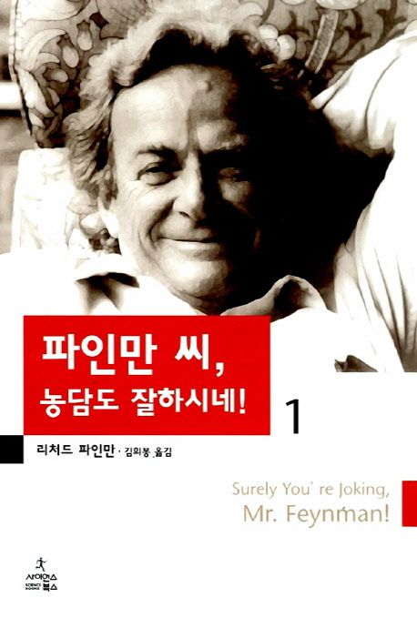

= 파인만씨, 농담도 잘 하시네! 1권(Surely, You're joking, Mr.Feynman 1)
리차드 파인만, 김희봉 옮김 / 사이언스 북스

== 기억나는 구절

p.67::
나는 교수들에게서 몇몇 회사의 추천장을 얻었는데, 하나는 바슈롬 사에서 레이 트레이싱을 하는 일이고, 하나는 뉴욕의 전기 시험 연구소였다. 당시에는 물리학자가 뭐하는 사람 인지 아는 사람이 하나도 없었고, 기업에도 물리학자가 맡을 일자리는 전혀 없었다. 공학자는 괜찮지만, 물리학자에게 무슨 일을 시킬지 아는 사람은 아무도 없었다. 그런데 재미난 것은, 2차 대전이 끝나자 상황이 완전히 거꾸로 되었다. 어디에서나 사람들은 물리학자를 원했다. 그래서 대공황 말기에 나는 물리학자로 취직할 수가 있었다.

p.185::
모든 일이 약 1분 사이에 벌어졌다. 폭발로 주위가 환해졌다가, 점점 어두워졌다. 아마 나는 첫 번째 트리니티 테스트인 이 굉장한 폭발을 본 단 한 사람일 것이다. 다른 사람들은 모두 색유리를 통해 보았고, 10킬로미터 지점에 있었던 사람들은 바닥에 엎드려야 했기 때문에 보지 못했다. 나는 이것을 맨눈으로 본 유일한 사람일 것이다.

p.188::
어쨌든 거의 40년 동안 원자폭탄은 아무 소용이 없었다. 그렇지 않은가? 그래서 새 다리를 만드는 것이 소용없는 짓이라는 내 생각은 틀렸고, 나는 계속해서 새 것을 만드는 다른 사람을 찬양한다.