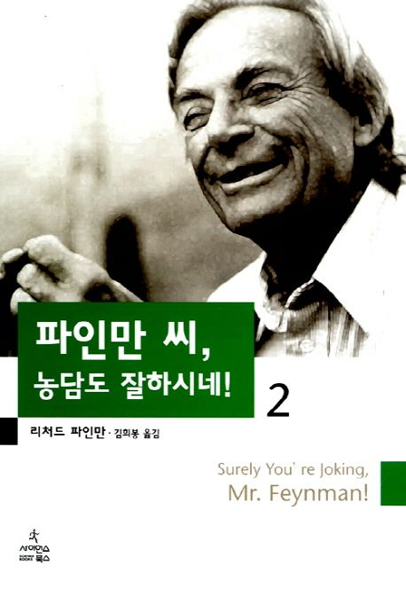

= 파인만씨, 농담도 잘 하시네! 2권(Surely, You're joking, Mr.Feynman 2)
리차드 파인만, 김희봉 옮김 / 사이언스 북스

== 기억나는 구절

p.116::
그래서 나는 답장을 썼다. <액수를 보고 나서, 나는 이걸 거절해야 한다고 판단했습니다. 그 정도의 봉급이면 내가 항상 원해왔던 것을 할 수 있기 때문입니다. 어여쁜 정부를 얻고, 아파트를 얻어주고, 좋은 물건들을 사 주고... 당신이 제인한 봉급이면 실제로 이렇게 할 수 있습니다. 그리고 나에게 어떤 일이 일어날지도 알 수 있습니다. 나는 그 여자를 걱정하고, 그 여자가 뭘 하고 있는지 항상 신경을 쓰겠지요. 집에 오면 말다툼이 벌어지겠지요. 이 모든 것들이 나를 불안하게 하고 불행하게 할 것입니다. 나는 물리를 잘 하지 못할 것이고, 이것은 엄천난 혼란일 뿐입니다! 내가 항상 바라던 일은 나에게 나쁜 일이기 때문에 나는 이 제안을 거절합니다.>

p.154::
나는 매우 열심히 하기로 약속했지만, 그래도 그가 나에게 그림 그리는 법을 가르칠 수 없다는 쪽에 걸었다. 나는 그림 배우는 법을 무척 배우고 싶었다. 세계의 아름다움에 대한 나의 느낌을 다른 사람에게 전달하고 싶었던 것이다. 하지만 느낌은 표현하기가 어려웠다. 자연에 대한 나의 느낌은 신이 우주를 관장하는 종교를 믿는 느낌과 유사하다. 모든 사물들이 다르게 보이고 다르게 움직이는 이면에 같은 물리 법칙과 같은 이치가 숨어 있다는 것을 느낀다면, 여기에는 공통적인 것이 있다. 이것은 자연의 수학적 아름다움을 음미하는 것이고, 자연이 속에서는 어떻게 움직이며 우리가 보는 현상이 원자들 사이의 복잡한 내부 운동의 결과라는 것을 아는 것이다. 이것은 아주 극적이고 놀라운 느낌이다. 이것은 (과학적인)경외로, 나는 그림을 통해 같은 느낌을 가진 사람들과 소통할 수 있을 것 같았다. 그림을 보는 사람은 한 순간 우주의 영광에 관한 느낌을 가질 것이다.

p.206::
"주차요금 영수증도 가지고 계십니까?" +
"없습니다. 하지만 주차비가 2달러 35센트 였어요." +
"우리는 영수증이 있어야 합니다." +
"내가 얼마인지 말했습니다. 내 말을 못 믿는다면 어떻게 저에게 교과서에 대해 좋다 나쁘다라고 말하게 합니까?"

p.267::
제 1원칙은 자기 자신을 속이지 않는 것이다. 가장 속기 쉬운 사함은 나 자신이다. 그러므로 당신은 여기에 대해 아주 주의를 기울여야 한다. 당신을 속이지 않는다면, 다른 과학자들을 속이지 않는 것은 쉬운 일이다. 그 다음부터는 관습적인 방법으로 정식하게 하면된다.

p.272::
그래서 나는 여러분에게 한 가지 바라는 것이 있다. 내가 설명한 과학정 통합성을 유지할 만큼 자유스러운 곳, 즉 조직체 내에서의 지위나 자금 지원, 또는 다른 어떤 문제 때문에 강제로 이러한 통합성을 잃게 되지 않는 곳에 속해 있기를 바란다. 여러분이 이런 자유를 누리기를 기원한다.