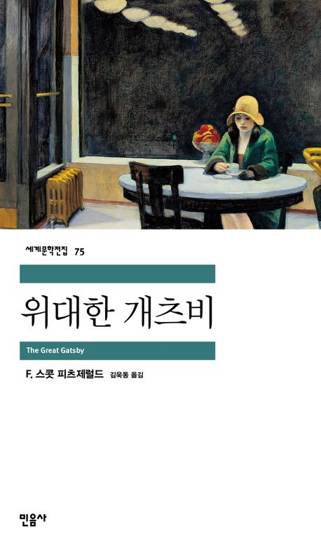

= 위대한 개츠비
F. 스콧 피츠제럴드, 김희봉 옮김 / 민음사 / 세계문학전집 75 

== 기억나는 구절

p.139::
작별 인사를 하려 개츠비에게 갔을 때 그의 얼굴에는 다시 당혹스러운 표정이 떠올라 있었다. 지금 그가 누리고 있는 행복이 얼마만한 가치가 있는 것인지 어렴풋이 의심이 생긴 듯 한 표정이었다. 오 년에 가까운 세월! 심지어 그날 오후에도 데이지가 그의 꿈에 미치지 못하는 순간이 있었을지 모른다. 물론 그녀의 잘못이라기 보다는 그가 품어 온 환상의 거대한 힘 때문에 말이다. 그 환성의 힘은 그녀를 초월하였으며 모든 것을 뛰어넘었다. 그는 창조적인 열정으로 직접 그 환상에 뛰어 들어 그 환상을 끊임없이 부풀어 오르게 했으며, 자신의 길 앞에 떠도는 운갖 빛나는 깃털로 그 환상을 장식했던 것이다. 그 어떤 정열로, 그 어떤 수순함도 한 인간의 그의 유령 같은 가슴속에 품게 될 것에 도전할 수 없으리라.

p.217::
나는 지금까지도 그때 그 말을 하길 잘했다고 생각한다. 나는 처음부터 끝까지 그의 행동에 찬성한 적이 없기 떄문에 그것이 그에게 해 준 유일한 찬사였다. 처음에 그는 정중하게 고개를 끄덕이더니 나중에는 활짝 밝아진 얼굴로 마치 그동안 줄곧 그 범행을 공모해 오기라도 한 것처럼 알았다는 듯 미소를 지었다. 그의 화려한 분홍색 양복이 하얀 계단을 배경으로 밝은 무늬를 이루고 있는 모습을 보자 문득 석 달 전 그의 고풍스러운 저택을 처음 방문했던 그날 밤이 떠올랐다. 잔디밭과 차도는 그가 부정한 짓을 저질렀다고 넘겨짚는 얼굴들로 붐볐다 - 그리고 그는 저 계단에 서서 부패하지 않는 꿈을 감춘 채 그들에게 손을 흔들어 작별 인사를 보내고 있었던 것이다.

p.227::
운전기사가 - 그는 울프심 일당 중 한 사람이었다 - 총소리를 들었다. 나중에 그는 그 총소리를 별로 대수롭게 생각하지 않았다고 말할 뿐이었다. 나는 기차역에서 개츠비의 집으로 곧장 차를 몰고 올라갔고, 내가 걱정스러운 마음에 서둘러 앞쪽 층계를 달려 올라간 다음에야 그 집에 있는 사람들이 처음으로 깜짝 놀랐다. 그러나 으때 이미 그들이 그 사실을 알고 있었다고 나는 지금도 굳게 믿고 있다. 운전기사, 집사, 정원사, 그리고 나 이렇게 네 사람은 한마디 말도 없이 풀장을 향해 서둘러 내려갔다. +
풀장 한쪽 끝에서 맑은 물이 흘러나와 다른 쪽 배수구로 밀려가기 때문에 물이 보일 듯 말 듯 움직이고 있었다. 물결이라고 까지는 할 수 없는 잔잔한 물살 때문에 개츠비를 태운 매트리스가 불규칙하게 풀장 아래로 움직였다. 수면에 잔물결 하나 만들지 못할 정도로 가벼운 한 줄기 바람만으로도, 예상치 못한 짐을 싣고 예상치 못한 방향으로 흘러가는 매트리스의 흐름을 방해하기에 충분했다. 매트리스는 수면 위에 떠 있던 나뭇잎 더미에 닿자 천천히 돌면서 마치 컴퍼스의 다리처럼 물 위에 붉은 동그라미를 남겨 놓았다. +
우리그 개츠비의 시체를 들고 집으로 간 뒤에야 정원에서 조금 떨어진 잔디밭에서 윌슨의 시체를 발견했다. 그 어처구니 없는 학살은 대단원의 막을 내렸던 것이다.